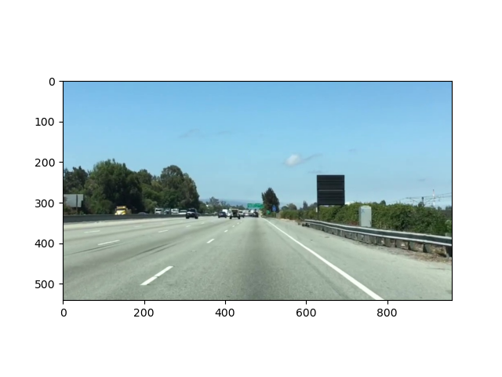

# OpenCV

Grayscale conversion

Canny Edge Detection

## Pixels
So what exactly is a pixel? A pixel is essentially just a point on an image, with a specific shade, color, and/or opacity. We normally represent a pixel as a single integer or multiple integers. Pixels take a specific form based on the interpretation of the image, which is usually one of the following:

- **Grayscale**: Viewing the image as shades of black and white. Each pixel is an integer between 0-255, where 0 is completely black and 255 is completely white.
- **RGB**: The default interpretation for color images. Each pixel is made up of 3 integers between 0-255, where the integers represent the intensity of red, green, and blue, respectively, for the pixel.
- **RGBA**: An extension of RGB with an added alpha field. The alpha field represents the opacity of an image, and in this Lab we'll represent a pixel's alpha value as an integer from 0-255 with 0 being fully transparent and 255 being fully opaque.
We can choose to interpret an image however we want, but there is usually one interpretation that is optimal. For example, we could interpret a black and white image with RGB pixel values, but it is more efficient to view it as a grayscale image (3x fewer integers used). On the other hand, it would be unwise to interpret a colored image using grayscale pixels, since the pixels won't be able to capture any of the actual colors.